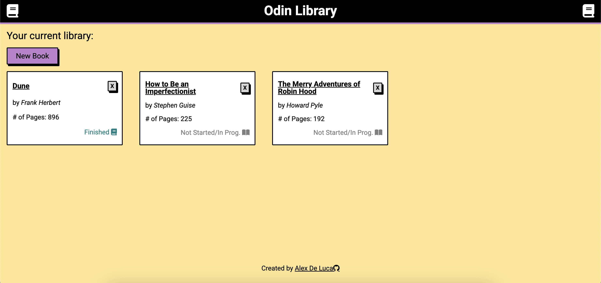
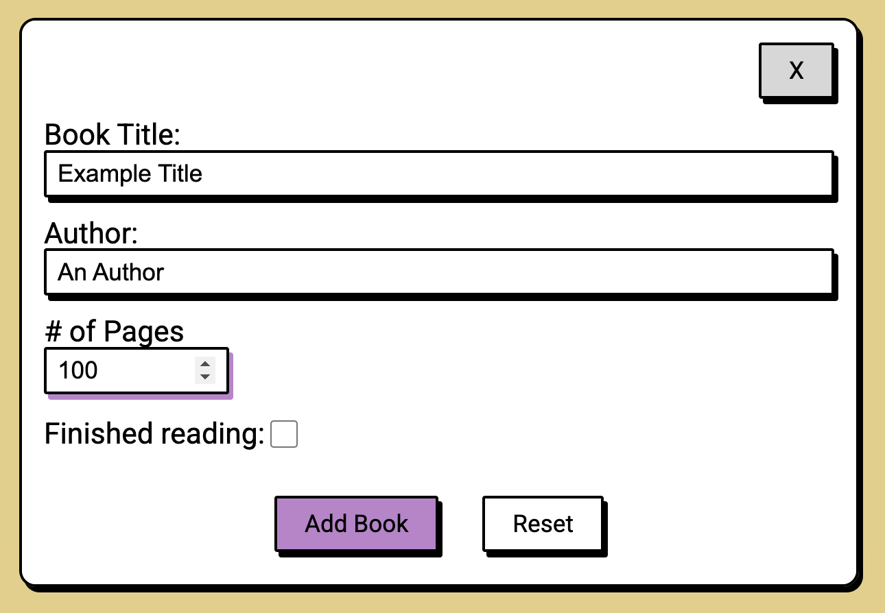
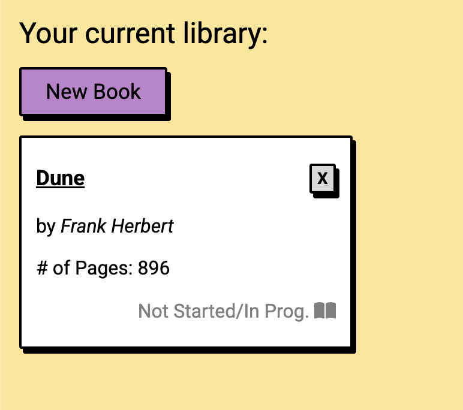

# 📚 Odin Library

The Odin Project Library project focuses on **prototypes** and **prototypical inheritance** for creating books to add to a library

## Features

- **Add** books to your library with information
- **Remove** existing books from your library
- **Toggle** read status of existing library books

## Screenshots

- Main page
  
- Modal form
  
- Hover Styling
  
